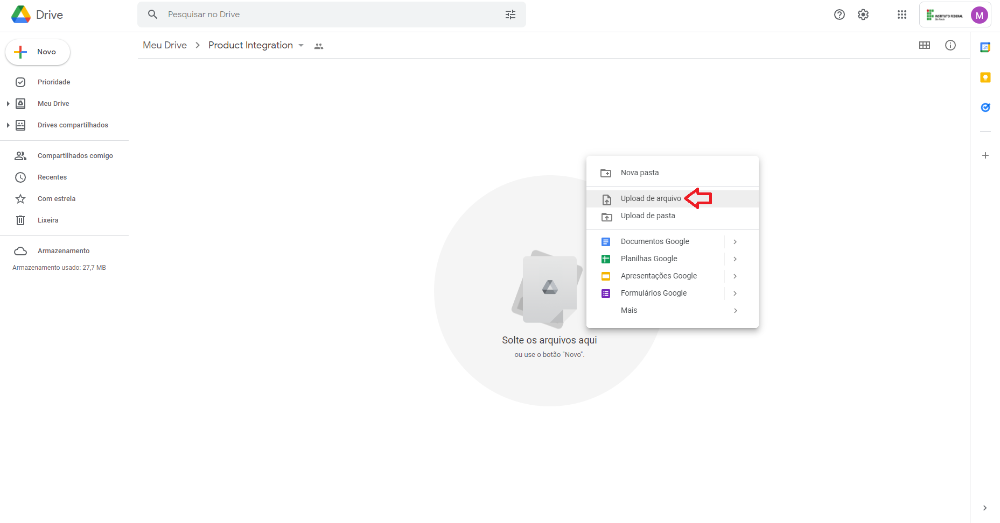
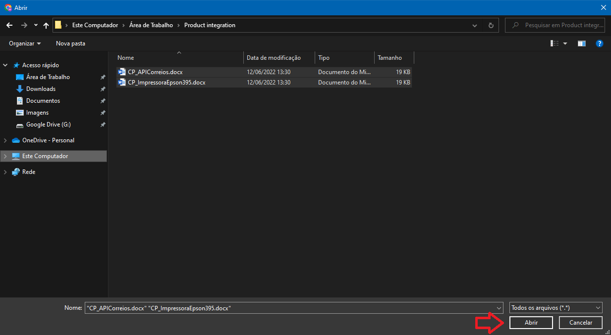
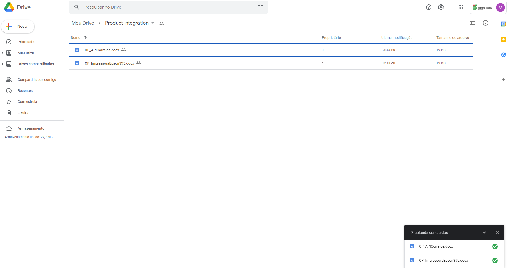

# Upload de arquivos
Após criada a pasta e concedidos os acessos basta fazer o upload dos arquivos para a pasta, como no exemplo abaixo.

## Exemplo

### Pasta no drive

### Seleção dos arquivos

### Arquivos no drive
