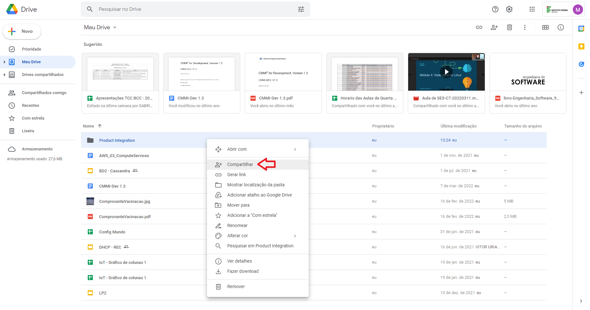
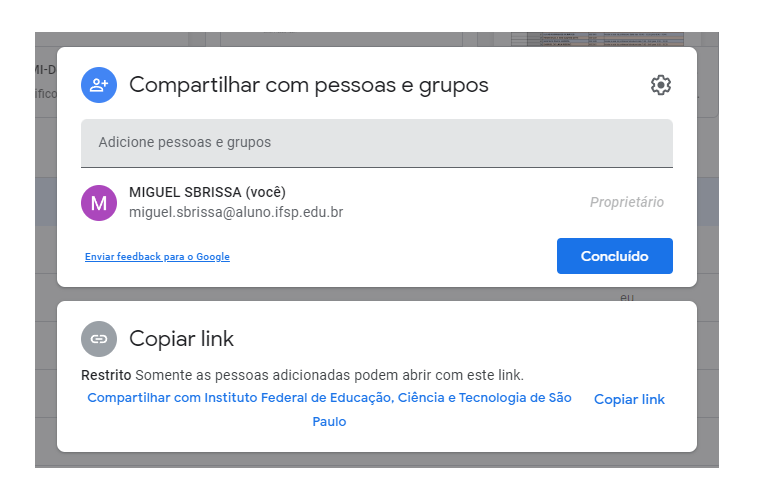
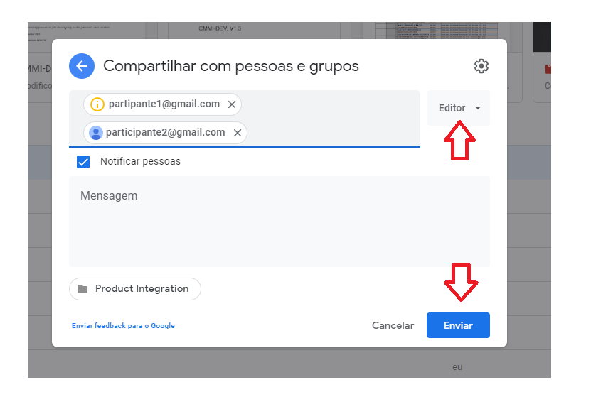

# Acesso aos integrantes
Após criada a pasta é necessário conceder acesso aos integrantes do processo. Para isso clique com o botão direito sobre a pasta e selecione compartilhar, depois basta  adicionar os e-mails dos participantes e escolher o tipo de permissão.

## Exemplo

### Compartilhar a pasta

### Adicionar participantes

### Escolher permissão
