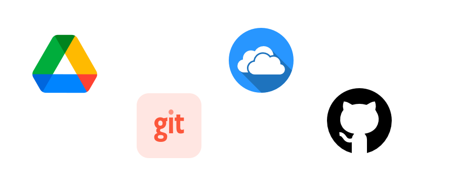

# Importância do acesso pela nuvem 
Para que todos os integrantes do projeto estejam a par do andamento do projeto é muito importante que os documentos gerados pelo processo sejam armazenados na nuvem e que todos os participantes tenham acesso. O acesso a nuvem pode ser feito através do Google Drive, OneDrive, Dropbox ou pelo Git com o Github ou similares. Nesse processo vamos utilizar o Google Drive pela facilidade de acesso e de criação, mas vale ressaltar que qualquer outra ferramenta é válida desde que esteja devidamente configurada.

