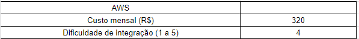
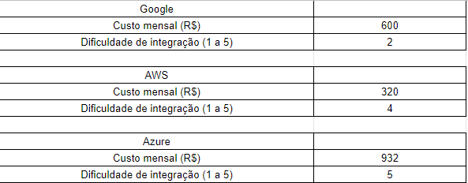

# Como usar a planilha para analisar o custo benefício de um ambiente de integração🔎

Após identificar os componentes de integração, verificações de integração, requisitos, critérios e decidir a melhor estratégia, é hora de verificar o custo benefício de comprar ou desenvolver o ambiente de integração.

Para isso, será necessário criar a planilha, baseada no exemplo abaixo

<svg style={{ width: 80, height: 80 }} viewBox="3 0 24 24">
    <path fill="green" d="M19,11V9H11V5H9V9H5V11H9V19H11V11H19M19,3C19.5,3 20,3.2 20.39,3.61C20.8,4 21,4.5 21,5V19C21,19.5 20.8,20 20.39,20.39C20,20.8 19.5,21 19,21H5C4.5,21 4,20.8 3.61,20.39C3.2,20 3,19.5 3,19V5C3,4.5 3.2,4 3.61,3.61C4,3.2 4.5,3 5,3H19Z" />
</svg>

[Baixar](https://ifspedubr-my.sharepoint.com/:x:/g/personal/tirabassi_matheus_aluno_ifsp_edu_br/EeJYBJzSKqpPiw2UctPZQg8BZt75x9r5HluAIkbw3Z7s-Q?e=tnNT2G)

## **Comparando custos do ambiente de integração**

Idealmente, queremos comparar o custo e a dificuldade de implementar o ambiente de integração ao nosso produto.
Por isso, sempre definimos a marca do ambiente de integração na primeira linha, já nas seguintes, o custo com o intervalo de tempo (mensal, semanal, diária) e a unidade monetária (R$ ou US).

## Exemplos

Exemplo 1

Exemplo 2

Como fica a planilha?

Nesse caso, estamos comparando o **ambiente de integração para teste automatizado**. Para modelar a planilha sempre pulamos uma linha entre os ambientes de integração, e caso necessitemos comparar outro tipo de ambiente de integração como o de *deploy automático*, é recomendado pular uma coluna para criar a comparação.
