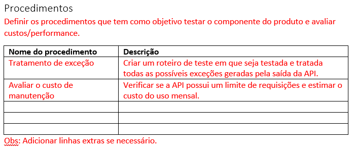
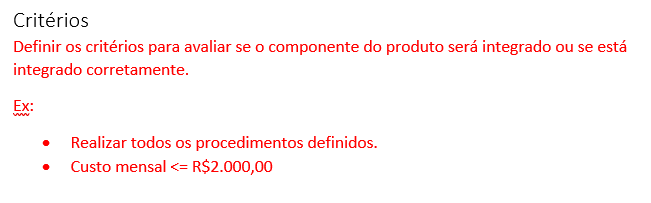

# Procedimentos e critérios

## Procedimentos
Nesta etapa serão definidos os procedimentos a serem feitos. Procedimentos para a integração do produto podem incluir: Testes de parâmetros e saídas, simulação do funcionamento, etc. Os procedimentos deverão ser especificados com base no [modelo do componente do produto](https://drive.google.com/file/d/1lskvh_tH3KCl87hPXBmuls7-y4xxWc0m/view?usp=sharing).

### Procedimentos

## Critérios
Nesta estapa devem ser definidos e registrados na [modelo do componente do produto](https://drive.google.com/file/d/1lskvh_tH3KCl87hPXBmuls7-y4xxWc0m/view?usp=sharing) os critérios para avaliar se determinado CP está integrado corretamente.

### Criterios de integração

