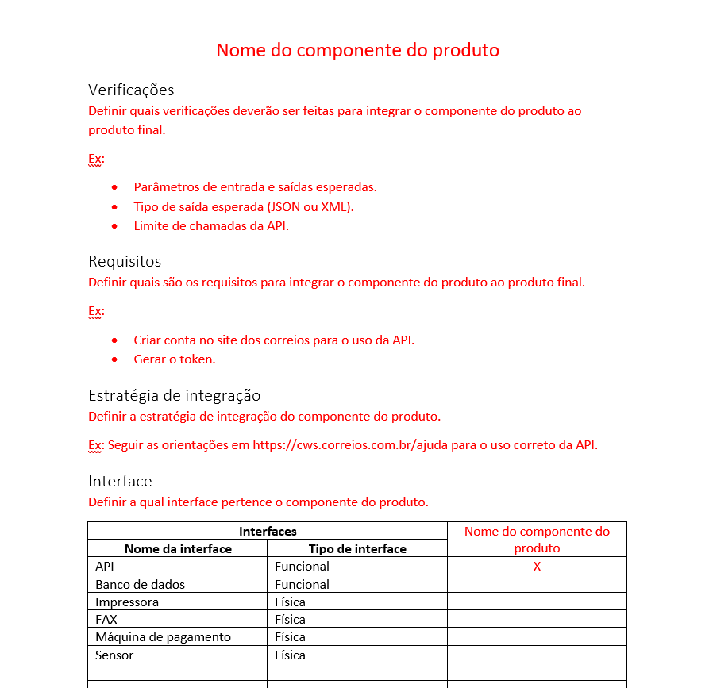

# Identificar os componentes do produto
 
## Como identificar?
Durante o levantamento de requisitos devem ser identificados os componentes do produto para serem integrados. Para o registro dos CP, faça o download da [modelo do componente do produto](https://drive.google.com/file/d/1lskvh_tH3KCl87hPXBmuls7-y4xxWc0m/view?usp=sharing) e coloque o nome do componente do produto e salve o arquivo no seguinte formato: **CP_NomeDoComponente.docx**. Lembre-se de salvar cada CP em um arquivo diferente e manter todos organizados no mesmo diretório. 

### Modelo do componente do produto
