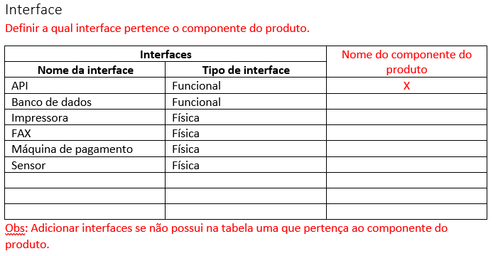

# Interfaces

## O que são interfaces?
Interfaces são como categorias dos componentes do produto, cada CP pertence a uma interface. Por exemplo: API e banco de dados são interfaces do tipo funcionais, já sensores e impressoras são interfaces do tipo físicas. Para relacionar cada CP a uma interface no [modelo do componente do produto](https://drive.google.com/file/d/1lskvh_tH3KCl87hPXBmuls7-y4xxWc0m/view?usp=sharing) deve ser selecionado qual interface pertence o CP, caso não tenha uma interface que se relacione com o componente do produto basta adicionar outra na tabela.

## Revisar interfaces
Para garantir que todos os componentes do produto estejam na interface correta, é necessário que após identificados todos os **componentes do produto** revise as interfaces selecionadas para que elas estejam abrangendo todos os componentes do produto.
