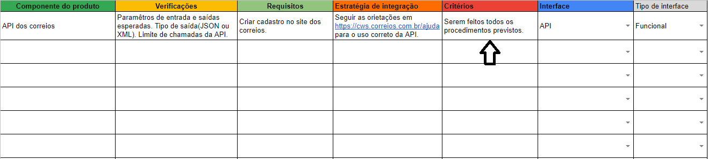

# Procedimentos e critérios

## Procedimentos
Nesta etapa serão definidos os procedimentos a serem feitos. Procedimentos para a integração do produto podem incluir: Testes de parâmetros e saídas, simulação do funcionamento, etc. Os procedimentos deverão ser especificados com base no [modelo de procedimentos](https://www.google.com.br/).

<!-- (Colocar img do modelo) -->

## Critérios
Nesta estapa devem ser definidos e registrados na [planilha de integração](https://www.google.com.br/) os critérios para avaliar se determinado CP está integrado corretamente. 

