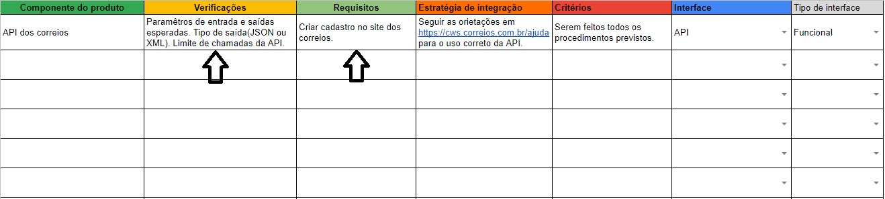
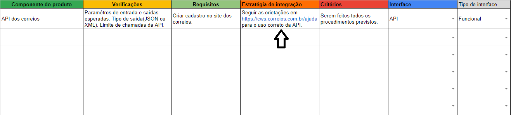

# Estratégia de integração

## Verificações e requisitos
Após identificados os CP deverá ser feita uma análise para identificar os requisitos e verificações necessárias para que eles sejam integrados corretamente. Por exemplo: na utilização de uma API é necessário analisar quais serão os parâmetros de entrada e qual será a saída esperada. Todas essas informações deverão ser registradas na [planilha de integração](https://www.google.com.br/).

## Definir a estratégia
Depois de feita a análise cabe ao líder do time de integração definir e registrar a estratégia de integração.

