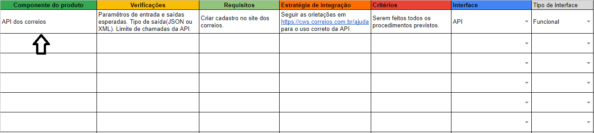

# Identificar os componentes do produto
 
## Como identificar?
Durante o levantemento de requisitos devem ser identificados os componentes do produto para serem integrados. Para o registro dos CP, faça o download da [planilha de integração](https://www.google.com.br/) e preencha a primeira coluna com os nomes do componentes que serão utilizados. 

