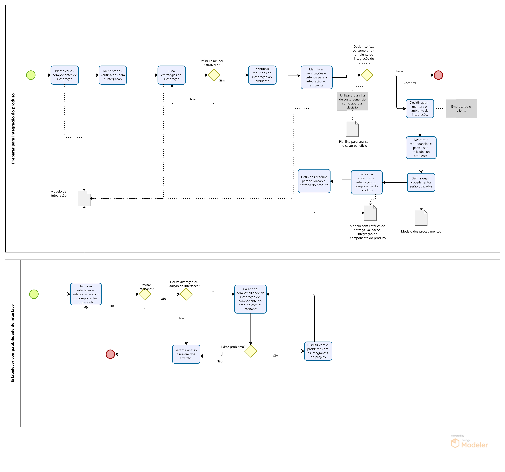

# Introdução

## O que é Integração do produto?
Integração do produto tem a finalidade de garantir que os **componentes do produto** sejam integrados ao produto final corretamente.

### Diagrama do procedimento

## O que são componentes do produto?
Componentes do produto (CP) são componentes externos que serão utilizados no seu projeto, por exemplo: uma API do google, que você utilizará no seu projeto é um componente de integração.

